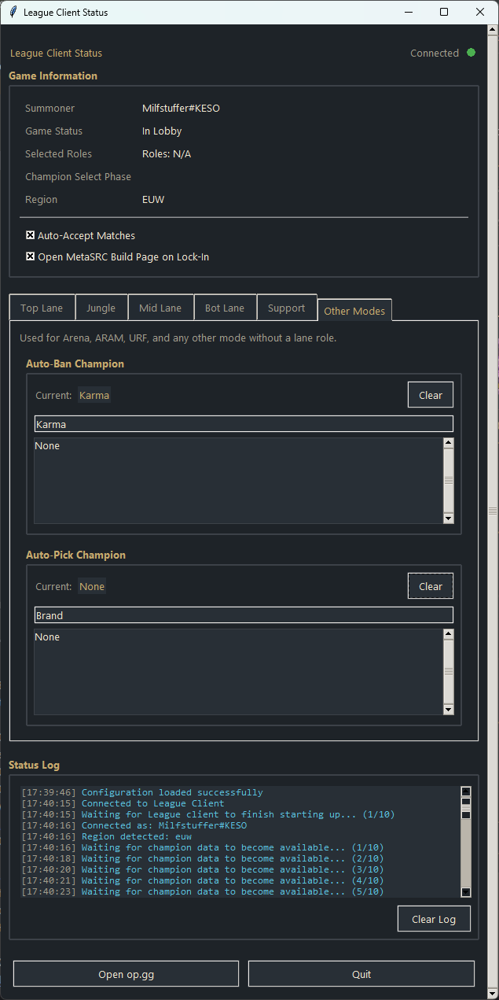

# League of Legends Helper



*A desktop companion for the League client — auto-accept, auto-ban/pick, and more.*

---

## Overview

A Python GUI that automates repetitive parts of matchmaking and champion select, using [`lcu_driver`](https://github.com/sousa-andre/lcu-driver) to talk to the League Client API.

## Features

- **Auto-Accept** matches
- **Per-role auto-ban / auto-pick** — set a champion for Top, Jungle, Mid, Bot, Support, plus a fallback **Other Modes** tab for Arena/ARAM/URF and anything without an assigned lane
- **Pre-hover** your intended pick from the start of champ select, so teammates see it before your turn
- **Teammate hover tracking** — logs what allies are hovering/locking in
- **Searchable champion pickers** for bans/picks
- **Live status panel** — summoner, connection state, readable game mode/queue (not raw codenames like `CHERRY`), champ select phase
- **MetaSRC build page** opens automatically once you lock in, routed to the Arena-specific page when applicable
- **One-click op.gg**
- **Auto-saved settings** — no manual save needed
- **Real-time log** of all actions

## Installation

**Prerequisites:** [Python 3.8+](https://www.python.org/) and the League client running.

```bash
git clone https://github.com/HyperKrille/LeagueOfLegends-Helper
cd LeagueOfLegends-Helper
pip install -r requirements.txt
python GUI.py
```

## Building a Standalone .exe

```bash
pip install pyinstaller
pyinstaller --onefile --windowed --name "LeagueHelper" --hidden-import lcu_driver GUI.py
```

The executable will be in `dist/`. `--onefile` bundles everything into one file; `--windowed` hides the console window.

## Configuration

Settings (role bans/picks, auto-accept, etc.) are saved automatically to `role_config.json` next to the executable. You can edit it by hand if needed — the GUI will pick up changes on next launch.